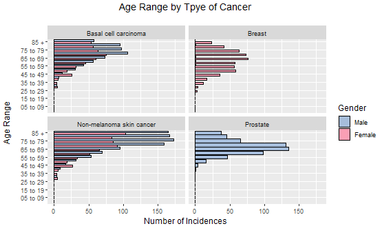
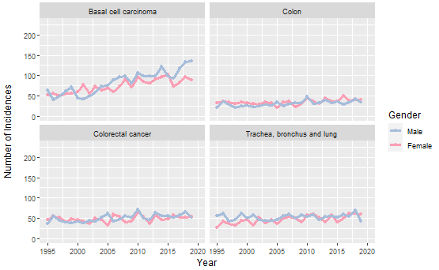

# Introduction

                        Report written by Malcolm Cheyne

 

# Brakedown of Cancers in NHS Borders

There are 51 types of cancer that are recorded across Borders that affect both men and women. Out of all these types of cancer the majority have less than 50 cases a year in NHS Borders.

Taking the top 7 types of cancer that are have more than 50 cases a year in NHS Borders.

* Non-melanoma skin cancer				
* Basal cell carcinoma of the skin				
* Breast				
* Trachea, bronchus and lung				
* Colorectal cancer				
* Squamous cell carcinoma of the skin				
* Colon

We can see a steady rise's for two skin cancers incidences over the 24 year period. Breast cancer comes in peaks that mite have come from increased publicity encouraging people to check or be tested in the lead up to the peaks.
They can be split by proactive and reactive approaches.

## Proactive

* We can see that three of them are based on skin cancers that have like developed from exposed to ultraviolet (UV) radiation from the sun. This can be combated with more publicity encouraging on when and how to using sunscreen, while in the local area or on holiday abroad.

* Trachea, bronchus and lung cancers, came mainly from direct or passive smoking. This can be combated with more publicity on the dangers of direct or passive smoking to people and their family. Can look at putting more support for people trying to quit.

## Reactive

* 2 are types Bowel cancers, while the cause of these is not known, certain risk factors are strongly linked to the disease, including diet, tobacco smoking and heavy alcohol use.

* Breast cancer is caused when the DNA in breast cells mutate or change, disabling specific functions that control cell growth and division.

 

# Cancer by Age and Sex Demographic's

Here we can see the brake down by age and gender showing the older the person is the greater risk they have. While women start by being at higher risk at a younger age older men make up the highest risk of cancer. This adds these ages to the demographic of targets to focus any publicity for proactive and reactive approaches. Both genders peak in the 70-74 range and men have the over take women as having the highest risk in the 55-59 range.

This is a brake down of Cancer type by age reinforces the demographic of targets to focus any publicity for proactive and reactive approaches.

* Skin and lung cancers both men and women being encouraged to take proactive while young.

* Breast and prostate cancers for women and men respectively should be checked regularly at these ages.
 

While almost all these cancers are shared equally between the two genders, two cancers breast and prostate have a traditional gender bias on which is effected.  As-well two of the skin cancers have a higher risk in men since around 2005 on wards. This can be a demographic to target to focus the publicity encouraging talked about above or showing the risk

 

# Health Boards comparason

In comparison to other local Health Boards, NHS Borders has a small percentage of the cancer incidences across Scotland

 

# Allover trend v Crude rate

Focusing in on NHS Borders we can see a steady rise in the number of cancer incidences over the 24 year period.  The crude rate that is measured by per 100,000 has lagged behind and not followed this increase since around 2004.

 

# References

The data used were all sourced from https://www.opendata.nhs.scot/. The links below are all the specific links to each dataset used:

https://www.opendata.nhs.scot/dataset/c2c59eb1-3aff-48d2-9e9c-60ca8605431d/resource/3aef16b7-8af6-4ce0-a90b-8a29d6870014/download/opendata_inc9519_hb.csv - Incidence by Health Board

https://www.opendata.nhs.scot/dataset/c2c59eb1-3aff-48d2-9e9c-60ca8605431d/resource/e8d33b2b-1fb2-4d59-ad21-20fa2f76d9d5/download/opendata_inc1519comb_hb.csv - 5 Year Summary of Incidence by Health Board

 
 
 
