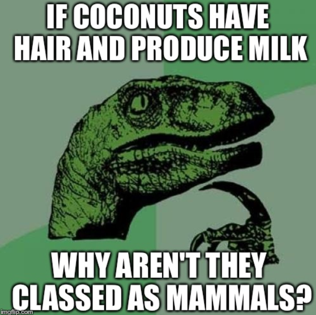
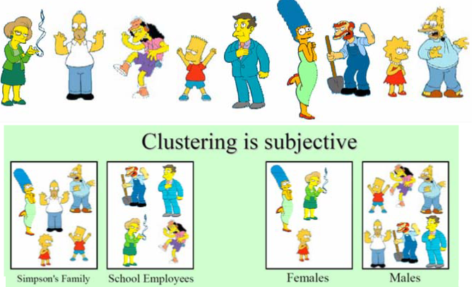
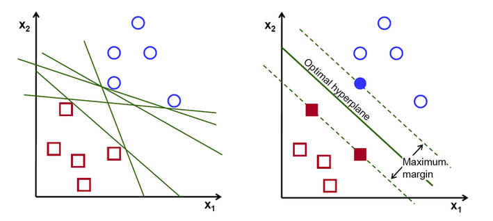

 
 
 

#### Classification will have a list of predefined classes to match up and see where a new object belongs to.

 

 

#### Clustering finds similar groups in the data and looks to see if there is any relationship between the objects.

 

 

#### In the context of machine learning, classification is supervised learning as someone has given it predefined classes to look for and clustering is unsupervised learning as it groups objects as it sees the data.

## Machine Learning Methods

#### Support Vector Machine (SVM) is a popular and adaptable Machine Learning model, capable of performing linear or nonlinear classification, regression, and outlier detection. It can produce precise data while using less computing power.
 

 

#### It does this by finding a plane that can noticeably classifies the data, known as hyperplane. There will be many of these hyperplane and with SVM is to find the plane with the greatest margin of distance between the classes.

https://stackoverflow.com/questions/5064928/difference-between-classification-and-clustering-in-data-mining

https://www.analyticsvidhya.com/blog/2021/07/svm-and-pca-tutorial-for-beginners/

https://en.wikipedia.org

https://imgflip.com/i/o6qr4 - meme

https://www.cs.cmu.edu/~epxing/Class/10701-08s/Lecture/lecture15-Clustering.pdf - meme